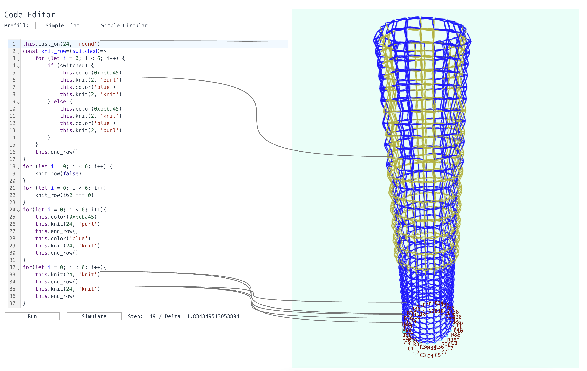

# KnitSim

KnitSim offers an integrated code and knitting simulation to exploratively design patterns and knitting pieces, while allowing the users to simulate the fabric stresses right in the web browser using WebAssembly!




Demo here: [KnitSim on Dakantz](https://knitsim.dakantz.at)

## Installation

Local installation:

```sh
cd knitviz-frontend
npm i -D
npm run dev
```

Docker build:

```sh 
cd knitviz-frontend
docker build . -t knitviz-frontend
docker run -it -p 16001:80 knitvknitviz-frontend 
```